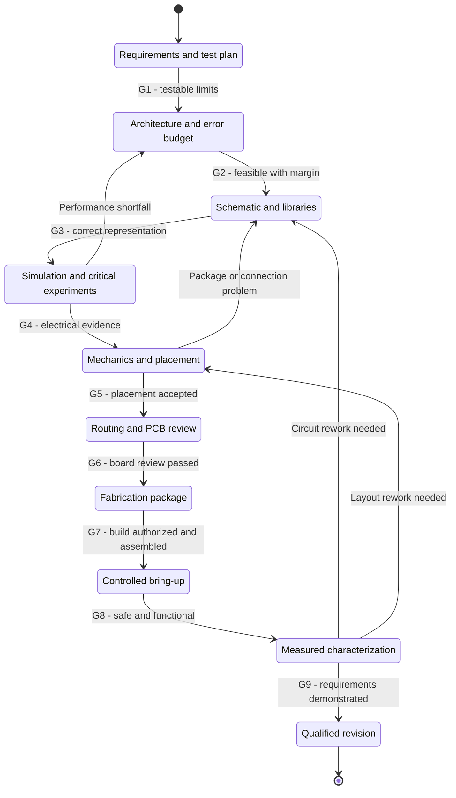
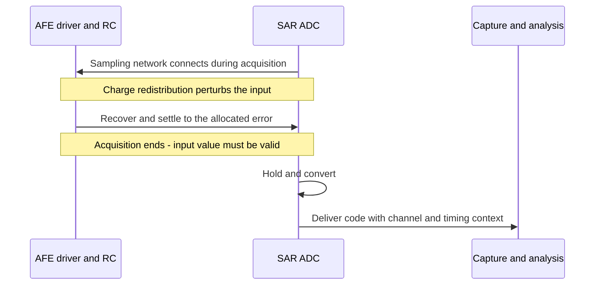

# AFE design with KiCad: workflow and quality gates

An analog front end (AFE) turns an external signal into something an
analog-to-digital converter (ADC) can measure accurately and safely.
Designing it means proving a chain: requirements, circuit behaviour,
physical implementation, then measured hardware performance.

**A quality gate is a decision supported by evidence, not a completed
drawing.** Passing KiCad's electrical rules check does not establish
bandwidth. Passing its PCB rules check does not establish low noise.
A successful simulation is evidence about a model, not a tested board.

This is a learning guide using **KiCad 10.x**, the project's required
CAD major version. It does not approve a circuit change, board order or
fabrication release. [AFE requirements](afe.md) define the design;
[the build plan](afe-plan.md) defines this project's sequence;
[the design review](../hardware/afe-shield/REVIEW.md) owns the findings.

## The workflow at a glance

The Mermaid UML state diagram shows the main progression and the common
return paths. A failed gate sends work back to the stage that can resolve
it; it is not a reason to quietly weaken the requirement.



This is not a rigid waterfall. Risky blocks may need an evaluation board
or experimental PCB before G4 can close. Mark that build as an experiment
with explicit questions and limits, not as a qualified product. In this
project, prototype measurements and a physical Due fit check remain
release gates even if development placement starts earlier.

## What each gate requires

| Gate | Work being accepted | Minimum evidence to move forward |
|---|---|---|
| **G1: requirements** | Define signals, environments and operating modes | Numerical limits, units, test conditions and verification method for each important requirement |
| **G2: architecture** | Choose protection, attenuation, bias, gain, filters, driver, reference and supplies | Headroom, timing, noise and error budgets fit with margin; key risks and alternatives identified |
| **G3: schematic** | Capture the circuit and exact parts in KiCad | ERC reviewed; critical nets checked; symbol, package, footprint and model pin mappings verified; ratings and jumper defaults explicit |
| **G4: electrical validation** | Test calculations, models and risky circuit blocks | Relevant DC, AC, transient, startup, load and corner results meet limits; model gaps and required bench experiments documented |
| **G5: mechanics and placement** | Establish the physical implementation | Connector fit, holes, keep-outs, stackup, footprints, decoupling and critical placement reviewed |
| **G6: routed PCB** | Route signals, power and return paths | Zones refilled; no unintended opens; schematic parity checked; DRC findings resolved or individually justified; manual analog-layout review complete |
| **G7: fabrication** | Freeze a reproducible build package | Exported copper, mask, drills, BOM and assembly data inspected against one source revision; build scope and unresolved prototype risks accepted |
| **G8: bring-up** | Establish safe basic operation | Inspection, resistance checks, current-limited power, rails, reference, bias and quiescent current acceptable before signal tests |
| **G9: characterization** | Demonstrate complete-chain performance | Measured results meet requirements under specified conditions; calibration, repeatability, uncertainty and limitations recorded |

## 1. Write requirements that can fail

Start with the signal and the converter, not an attractive op-amp.
Decide which operating modes need to work: one channel or several,
which input range, what source impedance, and what sample rate.

| Requirement area | Specify | Verification |
|---|---|---|
| Input | Normal range, source impedance, input resistance and capacitance | Calculations, DC sweep, impedance measurement |
| Frequency response | Passband, allowed ripple, cutoff and out-of-band rejection | AC simulation and measured sweep |
| Accuracy | Offset, gain error, linearity and temperature drift | Error budget, precision DC measurements |
| Dynamic behaviour | Step size, settling band, deadline, overshoot and overload recovery | Transient simulation and time-domain measurements |
| Noise and distortion | Measurement bandwidth, input condition, noise and harmonic limits | Appropriate models where supported; bench spectrum and noise measurements |
| Protection | Fault voltage, duration, source energy and powered/unpowered cases | Rating calculations and a controlled protection test plan |
| Environment | Supply range, temperature, load, cable and operating modes | Corner analysis and representative hardware tests |

"Flat past 5 MHz" needs an allowed gain deviation and a defined signal
amplitude. "Settles quickly" needs a step, an error band and a deadline.
Values used as examples in this guide are not new project requirements.

### Keep analog bandwidth separate from sampling bandwidth

A wideband driver may be useful for rapid settling even when the useful
signal band is much lower. It does not raise the ADC's sample rate.
At 886 ksps, ordinary baseband sampling has a Nyquist frequency near
443 kHz, and a practical anti-alias filter needs a transition band.
A 5 MHz driver target is therefore not a 5 MHz real-time scope claim.
Channel sequencing and any special sampling mode must be specified too.

## 2. Allocate errors before selecting components

For a 12-bit converter with a 3 V span:

```text
1 LSB = 3 V / 4096 = approximately 0.732 mV
0.5 LSB = approximately 0.366 mV
```

LSB means the ideal voltage increment represented by one digital code;
it is not a promise of 12-bit accuracy or 12 noise-free bits.

The reference, resistor ratios, amplifier offset, bias currents,
temperature drift and ADC all consume the system's error allowance.
Express contributions at the same point, usually the ADC input or the
external input. Combine bounded systematic errors conservatively;
root-sum-square treatment of independent noise needs its assumptions
stated. Do not spend the full system budget on every component.

Check input common-mode range, output swing at the actual load, slew
rate, settling, gain-bandwidth and supply headroom independently.
"Rail-to-rail" is not a guarantee of every operating point, and an
op-amp's gain-bandwidth figure is not the assembled signal path's bandwidth.

## 3. Use KiCad to capture an unambiguous circuit

Create functional sheets, meaningful net labels and useful test points.
Specify exact manufacturer part numbers, passive tolerances, capacitor
dielectrics and voltage/power ratings. Include supply decoupling,
unused amplifier handling and explicit configuration defaults.

| Mapping | What must agree | Typical failure |
|---|---|---|
| Symbol to package | Logical pin functions and datasheet pin numbers | A similar-looking part has a different pinout |
| Symbol to footprint | Pin numbers and physical pad numbers | Correct-looking package, wrong orientation or numbering |
| Symbol to SPICE model | Pin functions and subcircuit terminal order | A plausible plot from incorrectly connected model terminals |

Run **Inspect → Electrical Rules Checker** and inspect the critical nets
manually or through exported-netlist checks. Zero errors is useful, but
an erroneous connection between compatible pin types can still pass.
Do not globally suppress warnings to make a report look clean.

For this project, [the AFE README](../hardware/afe-shield/README.md)
explains how to locate D1 and U1 across the hierarchical sheets. U1's
several drawn units are one physical quad amplifier, not several ICs.
The [KiCad 10 schematic manual](reference/kicad-10/eeschema.pdf) covers
hierarchy, ERC and simulation.

## 4. Simulate the question, not just the schematic

KiCad's simulator uses ngspice. Add the stimuli, loads and component
models needed to answer a particular question; keep simulation-only
sources distinct from physical BOM parts. Verify model pin mapping and
compatibility before interpreting results.

| Analysis | Question | Important limitation |
|---|---|---|
| Operating point | Are bias voltages, currents and headroom plausible? | A solved operating point does not prove successful power-up |
| DC sweep | Is the transfer accurate throughout the input range? | Does not establish dynamic behaviour |
| Small-signal AC | What are gain, poles, peaking and bandwidth around this bias? | Does not establish full-amplitude slew or clipping |
| Transient | Does the specified step settle, including ringing and overshoot? | Results depend on time resolution and the represented load |
| Startup and load steps | Do references and buffers behave under ramps and disturbances? | A lumped capacitor may omit ferrite, wiring and sampling effects |
| Corners and tolerance sweeps | Does the result survive component, supply and temperature variation? | A parameter sweep only exercises effects the models implement |

Use manufacturer models with their original terms and provenance.
Keep project-specific adapters separate from the originals. A quad
amplifier built from four independent single-channel models does not
prove channel crosstalk. Consult the version-managed
[Microchip model guide](datasheets/microchip/AN1297-Op-Amp-SPICE-Models.pdf)
and [capacitive-load guide](datasheets/microchip/AN884-Capacitive-Loads.pdf).

### The ADC acquisition window is the settling deadline

A successive-approximation (SAR) ADC switches an internal sampling
network. Its driver must recover from that loading and establish the
required accuracy before acquisition ends. The whole sample interval
is not automatically available for this recovery.

The following is a conceptual sequence, not a SAM3X timing diagram;
derive the actual phases from the ADC documentation and register setup.



The series resistor and shunt capacitor help isolate the amplifier,
limit noise and supply sampling charge. Reducing the capacitor can
improve an AC plot while making sampled accuracy worse. Optimize the
driver and RC together against the actual ADC load. Analog Devices'
[SAR driver and RC design guide](https://www.analog.com/en/resources/analog-dialogue/articles/front-end-amp-and-rc-filter-design.html)
explains these trade-offs; the selected ADC's datasheet remains the
authority for its timing and input requirements.

At 886 ksps the sample interval is about 1.129 us. A model that takes
1.218 us to settle within one 3 V / 4096 code has not demonstrated that
timing target, let alone a shorter acquisition window. These are the
nominal Stage A example results documented at revision `e10a207` in
[the review](../hardware/afe-shield/REVIEW.md), not new measurements.
Settling to a final plateau and the plateau's DC accuracy are separate
checks; measure both.

## 5. Establish mechanics and review placement before routing

In KiCad, use **Tools → Update PCB from Schematic** to transfer the
design. Review proposed changes rather than accepting them blindly,
especially when an existing shield template fixes connector geometry.

| Area | Review before routing |
|---|---|
| Mechanics | Board outline, hole locations, connector mating, heights, enclosure and cable clearances |
| Footprints | Exact package dimensions, pad numbering, polarity, exposed pads and assembly needs |
| Manufacturing | Intended stackup, copper, supported drills, widths and clearances |
| Analog placement | Short feedback loops, nearby decoupling, ADC RC location and quiet reference paths |
| Coupling | Separation from clocks, switching power and high-current loops; sensible return paths |
| Testability | Accessible ground, power, reference and signal test points without excessive node loading |

A 3D view helps find collisions. It cannot prove an electrical pinout,
and the model itself can have incorrect dimensions. Physical mating is
still a gate. For MHz-class circuits, an evaluation or prototype PCB
can provide more representative evidence than a solderless breadboard.

## 6. Review the routed board as an analog circuit

Routing adds resistance, capacitance, inductance and coupling. Preserve
short feedback paths, avoid unnecessary capacitance at sensitive nodes,
and keep return currents out of reference and high-impedance regions.
A ground-plane split is not automatically an improvement: a signal
crossing a split can force its return current around a large loop.

Refill copper zones, run DRC, check schematic parity and inspect all
required connections. Then review the analog paths manually, including
decoupling return loops and coupling to the Due underneath the shield.
The [KiCad 10 PCB manual](reference/kicad-10/pcbnew.pdf) covers these
editor operations and fabrication exports.

| Check | Establishes | Does not establish |
|---|---|---|
| ERC | Compliance with configured schematic electrical rules | Correct transfer function or stability |
| SPICE | Behaviour of the represented circuit and models | Unmodelled parasitics or guaranteed hardware performance |
| DRC and schematic parity | Compliance with configured geometry rules and connectivity | Noise, distortion, suitable rules or correct footprints |
| 3D/mechanical review | Assembly plausibility against available geometry | Electrical function or unverified model accuracy |
| Bench testing | Behaviour of tested specimens under stated conditions | Untested corners or production-wide guarantees |

## 7. Release the exported package, not just the editable board

Freeze one source revision and generate the manufacturing files from
that revision. Inspect the Gerbers and drills in a viewer, as well as
the board in the editor. Check layer selection, outline, hole sizes,
mask openings, polarity, text and deliberately unpopulated parts.

The package needs a BOM with exact parts, assembly information, placement
data where required, fabrication notes, jumper defaults and a bring-up
procedure. Record any assembler-specific rotation or origin conventions.

An experimental build can carry open performance questions, but must
identify them and have an authorized, safe test plan. It must not be
labelled as a qualified design. Ordering or submitting the board is a
separate owner decision in this project.

## 8. Bring up cautiously, then characterize the complete chain

| Order | Action | Stop condition |
|---|---|---|
| 1 | Inspect orientation, soldering and configuration; check resistance before power | Short, reversed part or unexplained connection |
| 2 | Power with an appropriate current limit and controlled supply sequence | Excess current, heating, wrong rail or unexpected back-powering |
| 3 | Measure reference, mid-rail, bias and quiescent current; inspect for oscillation | Unstable or out-of-range voltage/current |
| 4 | Apply known, limited signals through the intended protected path | Clipping, abnormal recovery or unsafe node voltage |
| 5 | Measure DC accuracy, frequency response, settling, noise and distortion | Requirement exceeded or test setup unable to resolve the limit |
| 6 | Repeat relevant supply, temperature, channel, load and unit cases | Unexplained variation or inadequate margin |

Do not connect unknown external signals directly to the Due's ADC pins.
For Stage A, **keep JP1 open by default**; the AREF connection requires
the documented Due configuration and reference-load validation in
[the review](../hardware/afe-shield/REVIEW.md).

Record the instrument, probe loading, grounding, stimulus, sample timing,
firmware image, board identity and ambient conditions. Probe capacitance
is part of the circuit being measured. A loopback using one shared
reference can hide absolute reference error; an independent standard is
needed to establish volts. Repeat measurements on the same unit to
separate repeatability from variation across units.

Calibration may correct static offset and gain. It cannot remove
oscillation, aliasing, clipping or insufficient settling. Record both
uncalibrated and calibrated performance, and the conditions over which
the correction remains valid.

## Recording a gate decision

Use **pass**, **fail**, **not tested**, or **accepted exception**. An
exception needs a named approver, rationale and limited scope; it is not
a passing measurement. A blank result is not a pass.

| Field | What to record |
|---|---|
| Requirement and gate | Stable identifier, numerical limit and operating conditions |
| Method | Calculation, simulation or bench procedure; what could make it fail |
| Evidence | Result, units, trace/report link and relevant measurement uncertainty |
| Provenance | Source revision, exact tool/library/model versions; board and instrument identities where applicable |
| Decision | Outcome, margin, reviewer and remaining action or approved exception |

Keep KiCad sources, project libraries, simulation adapters and inputs,
test procedures and accepted review evidence under version control.
Original official references and models retain their license terms,
source URLs and checksums; see [the reference index](reference/README.md).
Keep disposable rerun outputs separate from evidence deliberately
retained for a gate or release.

## Applying this to the Due AFE

The project's letters describe **circuit blocks**, while G1-G9 describe
**quality gates**. They are different axes: each block needs appropriate
design and measured evidence.

| Project phase | Circuit or deliverable | Workflow relationship |
|---|---|---|
| A1 | Reference, mid-rail and DAC-to-ADC pin drivers, drawn | Requirements through electrical validation, G1-G4 |
| A2 | Stage A prototype, built and measured | Controlled bring-up and characterization, G8-G9, with prototype-specific build checks |
| C1 / C2 | DAC output conditioning, drawn / built | Repeat design and measurement gates for the output path |
| B1 / B2 | Input attenuation, protection, ranges and offset, drawn / built | Repeat design and measurement gates for the input path |
| P | Integrated PCB | Mechanics through fabrication, G5-G7, then repeat G8-G9 on the PCB against the prototype |

The order A, C, B, P and its rationale live in [the build plan](afe-plan.md).
Gate numbers here are explanatory, not a replacement for that plan.
The [AFE README](../hardware/afe-shield/README.md) gives reproducible
checks and GUI instructions; [the review](../hardware/afe-shield/REVIEW.md)
records which electrical and physical questions remain open.

The practical habit is to ask at every stage: **what claim am I making,
what evidence could disprove it, and what must be resolved before the
next irreversible step?**
