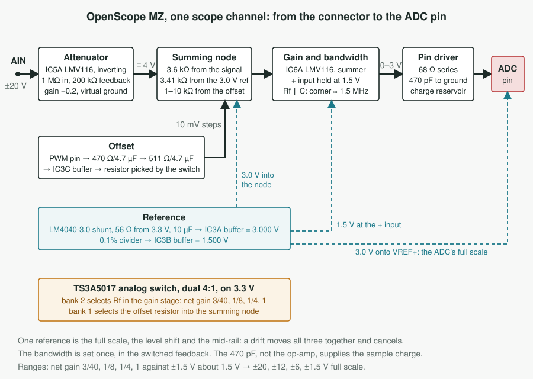
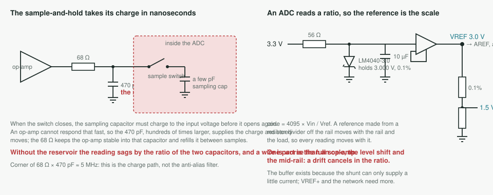
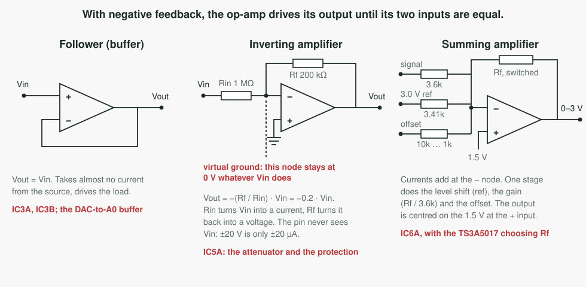

# The analog front end on the shield

**Status: a design note, nothing built.** It reads the OpenScope MZ
input stage and reference from their schematic sheets
(`docs/datasheets/openscope-mz/`), says what each part is for, and
says how each stage lands on a Mega shield over the Due. "Front end"
elsewhere in this project means the Qt window (`docs/frontend.md`);
this file is the analog one, so it is called the AFE.

Read `docs/noise.md` ("Within holds") for the measurement this exists
to satisfy, `docs/related-work.md` for the other designs compared, and
`docs/scope.md` Phase 3 for the list this fills in.

## The measurement first

The within-hold reading on three boards says the residual disturbance
is on the reading side: a random, symmetric, single-sample kick of
tens of codes, present with no signal, worse with USB traffic, removed
on one board by a stacked shield that touches nothing but the headers.
Two coupling paths are left open: the ADC pin and the wire feeding it,
and the reference and analog supply. The AFE's first two stages are
those two paths, and each is judged with `tools/gen_sweep.py` before
and after, on the board with the most residual, by the within-hold
rate and the largest excursion. That, not a bandwidth figure, is the
acceptance test.

## The OpenScope MZ input chain, part by part

One channel, from the connector to the ADC pin. Values are as printed
on the sheet.

| stage | parts | what it does |
|---|---|---|
| input attenuator | R31 1 MΩ into the inverting input of IC5A (LMV116), R30 200 kΩ feedback with C27 0.3 pF, non-inverting input at ground | gain −0.2, input impedance 1 MΩ. The inverting input is a virtual ground, so the pin never sees the input voltage, and 1 MΩ limits a ±20 V input to ±20 µA into the op-amp's own input clamps. That is the whole protection. ±20 V in gives ∓4 V out, which needs rails wider than 3.3 V; the sheet does not show this op-amp's supply |
| level shift into the summing node | R32 3.6 kΩ from IC5A's output, R33 1.2 kΩ + C29 1 µF + R34 2.21 kΩ from VREF3V0, C28 33 pF across R32 | the second stage is an inverting summer; the filtered 3.0 V reference through 3.41 kΩ is the current that centres the output when the input is zero, and C28 lets edges through the 3.6 kΩ faster than the node capacitance would |
| gain select | IC4 TS3A5017, a dual 4:1 analog switch on 3.3 V; bank 2 selects the feedback resistor of IC6A: R21 1.33 kΩ with C21 91 pF, R27 2.26 kΩ with C22 51 pF, R28 4.53 kΩ with C25 22 pF, R29 18 kΩ | gain −Rf / 3.6 kΩ: 0.37, 0.63, 1.26, 5.0. With the first stage's 0.2 the net gains are 3/40, 1/8, 1/4 and 1, the sheet's four ranges: ±20, ±12, ±6 and ±1.5 V full scale. Each feedback capacitor gives the same corner, about 1.3–1.6 MHz, so the bandwidth is set once, in the feedback, and holds across ranges; the manual's 2 MHz at −3 dB is this |
| second stage | IC6A LMV116, non-inverting input at VREF1V5 through R36 1 kΩ and C30 1 µF | the inverting summer whose output is the 0–3 V signal centred on 1.5 V |
| offset | PWM from the microcontroller through R22 470 Ω, C23 4.7 µF, R23 511 Ω, C24 4.7 µF (two poles near 70 Hz) into IC3C (LMV324) as a buffer, then bank 1 of the same switch selects R17 10 kΩ, R20 2.4 kΩ, R24 1.37 kΩ or R26 1.02 kΩ into the summing node | the offset resistor changes with the range so that one PWM step moves the trace by the same fraction of the screen at every gain; the 10 mV PWM step the manual quotes is this path's resolution |
| ADC pin driver | R35 68 Ω series, C31 470 pF to ground | the sample-and-hold's charge comes from the 470 pF, not from the op-amp through the switch, and the 68 Ω isolates the op-amp from the capacitor. The corner is about 5 MHz: this is not the anti-alias filter, the feedback capacitors are |

## The reference

| parts | what it does |
|---|---|
| D2 LM4040AIM3-3.0 shunt reference, R134 56 Ω from 3.3 V, C94 10 µF | a 3.000 V, 0.1% reference biased at about 5 mA, decoupled |
| IC3A LMV324 unity buffer, R132 5.36 kΩ + R133 4.64 kΩ + C93 1 µF at its input | VREF3V0, driven onto the chip's VREF+ pin and into the level-shift path with a source that can supply current |
| R135 5.36 kΩ, R136 4.64 kΩ, R137 10 kΩ, all 0.1%, C95 1 µF, IC3B LMV324 buffer | VREF1V5, exactly half the reference, the mid-scale the second stage centres on |

The reference is the ADC's full scale, the level shift's current and
the mid-rail, all from one part, so a drift moves everything together
and cancels in the ratio. That is the property to keep.

## Landing it on the shield

The Due's headers bring out every ADC pin, both DAC pins, 3.3 V, 5 V,
ground and AREF, so the whole chain fits on a stacked board. The bench
today is a loopback, DAC0 to A0 and DAC1 to A1 at 0.55–2.75 V, with no
external signal; the stages below are in the order the measurement
asks for them, and the first two are the ones with evidence behind
them.

### Stage A: the reference onto AREF, and the pin driver

- The LM4040-3.0 circuit as drawn, buffered, onto the Due's AREF pin.
  **Check the Due's own schematic first**: how ADVREF is tied to the
  3.3 V rail on the board decides whether a link must be cut before an
  external 3.0 V can hold the pin, and `docs/hardware.md` records
  ADVREF measured at 3270 mV, which says something already sits
  between the rail and the pin. A 3.0 V full scale costs 9% of the
  code range and buys a reference that is the scale itself, which is
  what the calibration direction wants; the VREF1V5 buffer onto a
  spare ADC pin is the second point the profile needs.
- A unity buffer from the DAC0 wire into A0 through 68 Ω and 470 pF,
  the same on A1. On a 3.3 V single rail the LMV116's output reaches
  the rails but its input does not, so a rail-to-rail-input part is
  needed for a follower: OPA2350 or OPA2354 class, or AD8656 for lower
  noise, all single-supply at 3.3 V *(check the input common-mode
  range of whichever is chosen against 0.55–2.75 V)*.
- Unused ADC pins tied to ground through a resistor; the bare-pin
  finding in `CLAUDE.md` is a pickup path too.

Judged by the sweep on the fourth board: if the within-hold rate does
not move, the coupling is not at the pin or the reference, and the
next stage is the supply and the ground return, not the attenuator.

### Stage B: attenuation, ranges, offset

OpenScope's first stage cannot run on 3.3 V: ±20 V in gives ∓4 V out.
Two honest ways to land it:

- **Keep the topology, add the rails.** A small boost and inverter as
  PSLab does gives ±5 V or ±6 V; the LMV116 is then replaced by a part
  rated for the wider supply, and everything on the sheet transfers
  as drawn, including the switch in the feedback path and the
  range-scaled offset.
- **Stay on 3.3 V, move the attenuation forward.** Reference the first
  stage's non-inverting input to VREF1V5 and give it the full 3/40 at
  once, 1 MΩ into 75 kΩ; the second stage then gains 1, 3.3, 6.7 and
  13.3 to reach the four ranges. It works, it costs noise in the
  sensitive ranges because the second stage amplifies the first
  stage's, and it keeps one supply. For a bench whose signals are the
  Due's own DAC, this is enough.

Either way the switch selects a feedback resistor, each with its own
capacitor so the bandwidth is set once, and the offset comes from a
Due PWM pin through the same two-pole RC and a range-scaled resistor.

### Stage C: the DAC output stage

The Due's DAC swings 0.55–2.75 V, 2.2 V peak to peak about 1.65 V. A
rail-to-rail op-amp at 3.3 V with a gain of 1.5 about 1.65 V puts that
at 0–3.3 V; a reconstruction filter after it; then Labrador's output
form, a 1 kΩ load, 56 Ω series to a DC pin and a 1 µF to an AC pin.
Protection on an output is a series resistor and the op-amp's own
current limit.

## What the shield cannot fix

The converter's supply pins are on the Due. If the sweep shows the
residual unchanged through stages A and B on the board with the most
of it, the coupling is through the analog supply or the ground under
the chip, and a proto shield has no plane to offer. That is the point
at which the answer is a board, not a shield.

## The parts, for a reader whose analog is twenty years old

Each part, what it is, and why it sits where it does, in the order the
signal meets them. The table after it is the same material as a
reference card.

**The op-amp, and the one rule that explains everything it does.**
LMV116, LMV324, MCP6H91 and LM324 are all operational amplifiers: a
differential amplifier with enormous gain, two inputs marked + and −,
one output. With negative feedback, some path from the output back to
the − input, the op-amp drives its output to whatever voltage makes
the two inputs equal. That single rule reads every stage on the sheet.

- *Follower, or buffer.* Output wired straight to the − input, signal
  on +. The output copies the input voltage, but the input draws
  almost no current and the output can supply plenty: an impedance
  converter, a weak source in and a strong source out. IC3A and IC3B
  in the reference are followers, and the buffer between the DAC wire
  and A0 is one too.
- *Inverting amplifier.* Signal through a resistor into the −, + held
  at a fixed voltage, feedback resistor from output to −. Because the
  op-amp keeps − equal to +, the − pin sits at that fixed voltage
  whatever the input does: a virtual ground when + is at ground. The
  input resistor turns the input voltage into a current, the feedback
  resistor turns that current back into a voltage, so the gain is
  minus the ratio of the two, 200 kΩ over 1 MΩ gives −0.2. This is
  IC5A, and it doubles as protection because the input pin never sees
  the input voltage, only the current the 1 MΩ lets through.
- *Summing amplifier.* The same with several input resistors into the
  − pin. Currents add at the node, so the output is a weighted sum of
  the inputs. IC6A sums the attenuated signal, the reference and the
  offset, each through its own resistor: level shift, gain and offset
  in one stage.

**Single supply and rail-to-rail.** University op-amps ran on ±15 V
with the signal swinging around ground. These run between ground and
3.3 V, so the signal swings around a made-up middle, 1.5 V here.
Rail-to-rail *output* means the output reaches within a few tens of
millivolts of ground and of 3.3 V; rail-to-rail *input* means the
inputs can too. The LMV116 has the first property and not the second,
which is fine for the inverting stages whose inputs sit at 1.5 V and
not fine for a follower that must track 0.55–2.75 V.

**Why LMV116 and LMV324 are different parts.** The LMV116 is fast,
about 45 MHz of gain-bandwidth, and is used where the signal passes
through. The LMV324 is four slow op-amps in one package, used where
nothing fast happens: the reference buffers and the offset buffer.
Speed costs money and current, so the sheet spends it only on the
signal path.

**MCP6H91 and MCP6H82.** Also op-amps, chosen because they run on
wider supplies, up to 16 V. The generator output must swing ±3 V and
the DC outputs ±5 V, which no 3.3 V part can do, so these sit on the
board's ± rails.

**LM4040, the shunt reference.** A very precise Zener diode. Fed a few
milliamps through a resistor, 56 Ω from 3.3 V here, it holds exactly
3.000 V across itself, to 0.1%, whatever the temperature or the rail
does. The resistor-divider mid-rail that Labrador and Scoppy use is
the opposite: it moves with the rail and with load. An ADC reads a
ratio, input over reference, so a reference that moves turns every
reading into a moving number. The buffer after it exists because the
reference can supply only a little current, and VREF+ plus the
level-shift network draw more than it should give.

**TS3A5017, the analog switch.** A relay with no moving parts: two
independent 4-way selectors, each connecting one of four pins to a
common pin under two logic lines, with a few ohms of resistance when
closed. It carries the signal current, which a logic gate cannot. In
the feedback path of IC6A it picks which resistor closes the loop, so
the range changes in software without a mechanical switch and without
touching the input. Its on-resistance adds to the feedback resistor,
which is the "−10" in the sheet's resistor formulas.

**The capacitor across each feedback resistor.** A capacitor passes
high frequencies more easily than low ones. In parallel with the
feedback resistor, the feedback strengthens at high frequency and the
gain falls, from the corner where the capacitor's impedance equals the
resistor's, 1/(2πRC). Each of the four feedback resistors carries a
capacitor sized so R × C is the same, about 120 ns, so every range
rolls off at the same 1.3–1.6 MHz. This is where the instrument's
bandwidth is decided, and it is also the anti-alias filter: anything
above the corner is attenuated before the ADC can fold it into the
band.

**The PWM offset.** The microcontroller has no spare DAC for the
offset, so it uses a PWM output, a square wave whose on-time fraction
is set in software. Two RC low-pass sections, 470 Ω with 4.7 µF and
511 Ω with 4.7 µF, average the square wave into a DC level
proportional to the on-time: a DAC made from one pin and four passive
parts, slow, with a little ripple, fine for an offset that changes
only when a knob turns. The Due has PWM pins and would do the same.

**The 68 Ω and 470 pF at the ADC pin.** A SAR ADC samples by briefly
connecting a small internal capacitor to the pin and letting it charge
to the input voltage, and that charge has to come from somewhere fast.
Driven only by an op-amp through the switch, the pin cannot deliver it
in the nanoseconds the sample takes and the reading sags. The 470 pF
is a reservoir hundreds of times larger than the sampling capacitor,
so it supplies the charge and barely moves; the 68 Ω keeps the op-amp
stable driving that capacitor and refills it between samples. The
standard idiom for driving any SAR converter, and the stage the
within-hold reading points at most directly.

**BAT46 and 1N5817, on the other sheets.** Schottky diodes, which
conduct at about 0.3 V instead of the 0.7 V of an ordinary diode.
Wired from a node to ground or to a rail, they clamp the node when it
tries to go beyond the rail by more than that drop. OpenScope has none
because the 1 MΩ into a virtual ground makes them unnecessary.

| part | what it is | why it is where it is |
|---|---|---|
| op-amp, any of them | a differential amplifier with enormous gain; with feedback from the output to the − input it drives the output to whatever makes the two inputs equal | that one rule reads every stage: a follower copies a voltage from a weak source to a strong one; an inverting stage holds the − input fixed (a virtual ground) and its gain is the ratio of two resistors; a summing stage adds currents at that fixed node |
| LMV116 | a single op-amp, about 45 MHz gain-bandwidth, single supply, rail-to-rail output but not input | the two stages the signal passes through; its inputs sit at 1.5 V so the input range does not matter there, and it would matter for a follower tracking 0.55–2.75 V |
| LMV324 | four slow op-amps in one package | the reference buffers and the offset buffer, where nothing fast happens |
| MCP6H91, MCP6H82 | op-amps rated to 16 V | the generator and DC outputs that must swing ±3 V and ±5 V on the board's ± rails |
| LM4040-3.0 | a shunt reference: a precise Zener that holds 3.000 V to 0.1% given a few milliamps through a resistor | an ADC reads input over reference; a divider mid-rail moves with the rail and the load, this does not. Buffered because it can supply little current itself |
| TS3A5017 | a dual 4:1 analog switch: a relay with no moving parts, a few ohms when closed, set by two logic lines | in the feedback path it picks the range in software without touching the input; its on-resistance is the "−10" in the sheet's resistor formulas |
| capacitor across a feedback resistor | passes high frequencies, so the feedback strengthens and the gain falls above 1/(2πRC) | every range's R×C is about 120 ns, so the bandwidth is set once at 1.3–1.6 MHz, and it is the anti-alias filter |
| PWM through two RC sections | a square wave whose on-time is set in software, averaged into a DC level | a DAC made from one pin and four passives, for an offset that changes only when a knob turns |
| 68 Ω series, 470 pF shunt | a charge reservoir hundreds of times the ADC's sampling capacitor, and a resistor that keeps the op-amp stable into it | a SAR ADC takes its sample charge in nanoseconds, faster than any op-amp responds; the standard idiom for driving one, and the stage the within-hold reading points at |
| BAT46, 1N5817 (other sheets) | Schottky diodes, conducting at about 0.3 V | clamps that hold a node within a rail; OpenScope needs none because 1 MΩ into a virtual ground already limits the current |

Reading a sheet: follow the signal left to right; at each op-amp ask
what the feedback forces the − input to be, which resistor turns the
input into a current and which turns it back into a voltage; at each
capacitor ask whether it filters, decouples or sets a corner; at each
three-terminal part ask whether it switches, references or amplifies.
