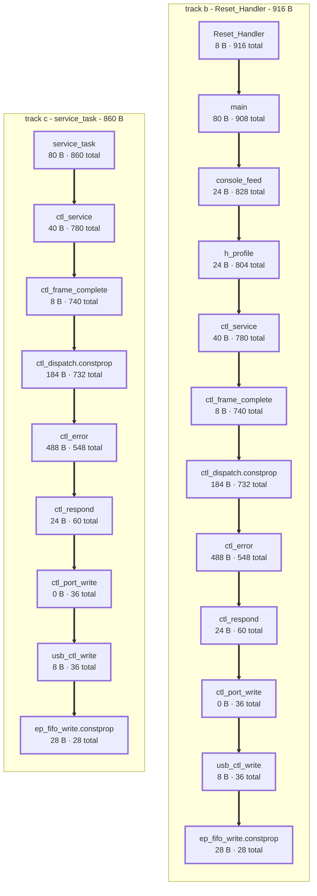

# Worst-case stack depth

Invariant 7 asks for a bounded worst case in every ISR and every
main-loop pass. The arithmetic half of that is the sum of the stack
frames along the deepest reachable call chain, and `tools/stack_depth.py`
computes it from the call graphs GCC writes under
`-DFIRMWARE_CALLGRAPH=ON`. Each run appends one provenance-stamped row
per image to `records/stack-depth.jsonl`; `tools/stack_report.py`
generates the tables and the diagram below from those rows.

The prose here is hand-written and the marked regions are not. Between
`<!-- generated: name -->` and `<!-- end generated -->` nothing survives
regeneration, so a caveat put next to the number it qualifies is
destroyed by the next `--write`. Caveats belong out here.

## What this measures, and what it does not

| question | answer |
|---|---|
| How big is one function's frame? | `tools/stack_frames.py`, a census over the whole image |
| How deep can the stack get? | `tools/stack_depth.py`, which walks the call graph |

Neither substitutes for the other. A census finds an unbounded frame; a
depth bound finds a chain that does not fit. A 512-byte frame in a leaf
that runs once at boot is harmless, and three 200-byte frames nested
under an ISR are not, and the census reports the same number for both.

Track A is absent from every table below, and that is a stated gap
rather than a zero. Its vendored Arduino core is a separate CMake target
compiled `-w`, so `-fcallgraph-info` does not reach it and the graph
would be missing every core function rather than merely unable to follow
an edge into one.

## Three states, and why refusing beats guessing

| state | meaning |
|---|---|
| exact | every edge on the chain was resolved |
| upper bound | an edge was over-approximated, and the report names it |
| unresolved | an edge could not be followed - **no number is printed** |

A stack tool that prints a number when it could not follow an edge is
the guard that cannot fail: the report is green, the property goes
unwatched, and nobody looks again. Nobody notices a bound that is too
generous until the stack is already through the heap. GCC makes the
third state possible by being explicit - an indirect call is not dropped
from the graph, it becomes an edge to a placeholder node carrying the
source location, so an unfollowable edge is a loud unknown rather than a
silent subtraction.

What resolves such a site is a claim, and the claims are tracked in
`tools/stack_depth.list` rather than retyped into a shell: a `const`
dispatch table, whose entries are read back out of the linked image and
so cannot drift; `noreturn`; or `none`, the weakest, which has to say on
its line what would falsify it. A site with no line there is refused.

The generator inherits that discipline at the last step. An absent field
renders as `(absent)`, never as a zero or a dash that would read as a
measurement, and a missing or empty record is an error rather than an
empty table.

## The bounds

<!-- generated: bounds -->
| track | root | bytes | state | functions | indirect sites/targets |
|---|---|---|---|---|---|
| b | Reset_Handler | 916 | exact | 345 | 2 / 50 |
| b | TC2_Handler | 236 | exact | 345 | 2 / 50 |
| b | UOTGHS_Handler | 96 | exact | 345 | 2 / 50 |
| b | hard_fault_report | 56 | exact | 345 | 2 / 50 |
| b | UART_Handler | 16 | exact | 345 | 2 / 50 |
| b | _write | 16 | exact | 345 | 2 / 50 |
| b | usb_dma_out_start | 16 | exact | 345 | 2 / 50 |
| b | DACC_Handler | 12 | exact | 345 | 2 / 50 |
| b | SystemCoreClockUpdate | 8 | exact | 345 | 2 / 50 |
| b | _read | 8 | exact | 345 | 2 / 50 |
| c | service_task | 860 | exact | 466 | 5 / 50 |
| c | console_task | 844 | exact | 466 | 5 / 50 |

Roots whose bound is 0 B are not listed: 19 on track b, 0 on track c. `functions` and `indirect sites/targets` describe the whole graph the walk ran over, so they repeat down a track's rows.
<!-- end generated -->

## The deepest chain

<!-- generated: chains -->
| track | # | function | frame B | total below B |
|---|---|---|---|---|
| b | 0 | Reset_Handler | 8 | 916 |
| b | 1 | main | 80 | 908 |
| b | 2 | console_feed | 24 | 828 |
| b | 3 | h_profile | 24 | 804 |
| b | 4 | ctl_service | 40 | 780 |
| b | 5 | ctl_frame_complete | 8 | 740 |
| b | 6 | ctl_dispatch.constprop | 184 | 732 |
| b | 7 | ctl_error | 488 | 548 |
| b | 8 | ctl_respond | 24 | 60 |
| b | 9 | ctl_port_write | 0 | 36 |
| b | 10 | usb_ctl_write | 8 | 36 |
| b | 11 | ep_fifo_write.constprop | 28 | 28 |
| c | 0 | service_task | 80 | 860 |
| c | 1 | ctl_service | 40 | 780 |
| c | 2 | ctl_frame_complete | 8 | 740 |
| c | 3 | ctl_dispatch.constprop | 184 | 732 |
| c | 4 | ctl_error | 488 | 548 |
| c | 5 | ctl_respond | 24 | 60 |
| c | 6 | ctl_port_write | 0 | 36 |
| c | 7 | usb_ctl_write | 8 | 36 |
| c | 8 | ep_fifo_write.constprop | 28 | 28 |

track b: Reset_Handler, 916 B; track c: service_task, 860 B.
<!-- end generated -->

## Reading the diagram

A box is one function and carries two numbers: its own frame, and the
deepest total from that function down. An edge runs from a caller to the
callee that made it the deepest, and the highlighted path is the
worst-case chain - which in this diagram is the whole of it, because the
record carries that chain and nothing beside it. So each box's total is
its own frame plus the total of the box below, and the bottom box's two
numbers are equal.

A gap between the two numbers means the chain continues into functions
that are not drawn. That is the ordinary case in the pruned picture
`tools/stack_depth.py --mermaid` emits, which keeps only the nodes
carrying more than a floor and prints inside the image how many it left
out; it does not arise here.

<!-- generated: diagram -->

<!-- end generated -->

## What the graph shows and the chain cannot

Two findings, both measured on Track B on `linux-x1` with Debian
arm-gcc 14.2.1, and neither visible in a table of one path.

**`ctl_error` is reached three ways** - from `ctl_service` directly,
through `ctl_frame_complete` into `ctl_dispatch`, and under `h_profile`.
Its 488 B is charged to every path through the control channel, not
only to the deepest one, so it is not a peak to be routed around.

**The three large frames are siblings and never stack.** `ctl_error`
488 B, `console_cmd_occ_hist` 504 B and `console_cmd_crosstalk` 456 B
all hang off `console_feed`, and none calls another. Shrinking
`ctl_error` to zero therefore moves the Track B bound from 908 B to
about 680, not to 420: `console_cmd_crosstalk` becomes the winner.
Fixing one of the three buys little, which is a design conclusion the
deepest-chain table structurally cannot reach.

## Provenance

<!-- generated: provenance -->
| track | bench | repo_rev | cc | elf | elf_sha256 | taken_at |
|---|---|---|---|---|---|---|
| b | linux-x1 | baa8039-dirty | GCC: (15:14.2.rel1-1) 14.2.1 20241119 | baremetal_bringup.elf | 604e50ee387862a3 | 2026-09-08T13:39:33-0400 |
| c | linux-x1 | baa8039-dirty | GCC: (15:14.2.rel1-1) 14.2.1 20241119 | rtos_bringup.elf | dc74d7846c974002 | 2026-09-08T13:39:33-0400 |

Schema `stack-depth/1`, written by `tools/stack_depth.py`, resolving its indirect call sites from `tools/stack_depth.list`.
<!-- end generated -->

## Re-taking it

```sh
cmake -B build -DCMAKE_TOOLCHAIN_FILE=cmake/arm-none-eabi-toolchain.cmake \
      -DCMAKE_BUILD_TYPE=Release -DFIRMWARE_CALLGRAPH=ON
cmake --build build -j
python3 tools/stack_depth.py build --elf build/baremetal_bringup.elf \
        --track b --record >> records/stack-depth.jsonl
python3 tools/stack_report.py --write
```

`python3 tools/stack_report.py --check` proves that this document
matches the record. It cannot prove the record is current: the generator
reads JSON and writes Markdown with no ELF, no build and no toolchain in
its path, so a stale record and a document generated from it agree
perfectly and the check passes for ever. A bound is only as fresh as the
image the row names.
