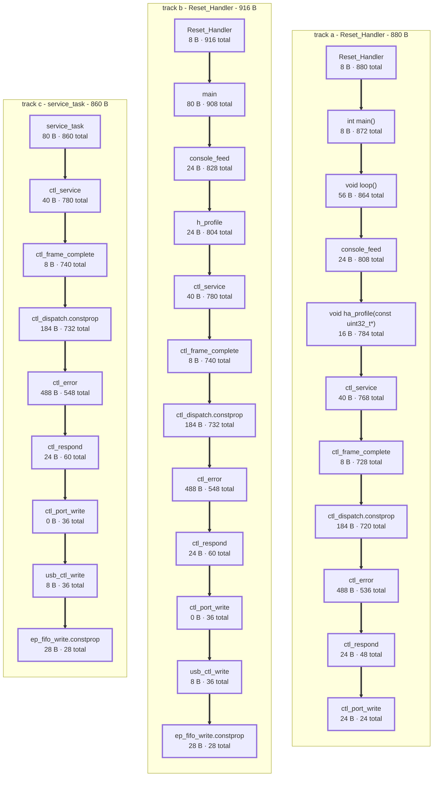

# Worst-case stack depth

Invariant 7 asks for a bounded worst case in every ISR and every
main-loop pass. The arithmetic half of that is the sum of the stack
frames along the deepest reachable call chain, and `tools/stack_depth.py`
computes it from the call graphs GCC writes under
`-DFIRMWARE_CALLGRAPH=ON`. Each run appends one provenance-stamped row
per image to `records/stack-depth.jsonl`; `tools/stack_report.py`
generates the tables and the diagram below from those rows.

The prose here is hand-written and the marked regions are not. Between
`<!-- generated: name -->` and `<!-- end generated -->` nothing survives
regeneration, so a caveat put next to the number it qualifies is
destroyed by the next `--write`. Caveats belong out here.

## What this measures, and what it does not

| question | answer |
|---|---|
| How big is one function's frame? | `tools/stack_frames.py`, a census over the whole image |
| How deep can the stack get? | `tools/stack_depth.py`, which walks the call graph |

Neither substitutes for the other. A census finds an unbounded frame; a
depth bound finds a chain that does not fit. A 512-byte frame in a leaf
that runs once at boot is harmless, and three 200-byte frames nested
under an ISR are not, and the census reports the same number for both.

Both read the linked image and the compiler's own call graph. Neither
runs the firmware, so neither can see a depth that only a particular
input reaches: what they bound is the worst case the graph allows, which
is the conservative side to be on and is the side invariant 7 asks
about.

## Where the three tracks stand

All three tracks are measured, all three carry a bound, and all three
are in every table below. They do not all carry the same *kind* of
bound, and the difference is the point of the state column.

| track | image | answer |
|---|---|---|
| A | the Arduino core, `sketches/bringup/` | **upper bound**, on every root. A virtual call inside an abstract base can land in any concrete subclass, so the target set is a union over the image's vtables |
| B | bare metal, `apps/baremetal_bringup/` | exact, on every root |
| C | FreeRTOS, `apps/rtos_bringup/` | exact, on every root |

Track A is a ceiling and the other two are measurements. Read its
figure as "no more than", and do not compare it with B's as though both
were the same quantity - the section on virtual dispatch below says
what the union costs and what was measured about narrowing it.

**A track with no number would be a row, never a gap.** The format is
built for that case whether or not one is in it: the bounds table
carries `(no bound)` where the others carry a figure, with the blocker
in the cell beside it, and the diagram draws a box saying what stopped
the walk. Dropping the track instead would make the comparison silently
two-track, and an absent track reads as "not measured" or as "fine"
depending on who is reading - the body-of-zeroes failure one level up,
in a document instead of a protocol.

## Three states, and why refusing beats guessing

| state | meaning |
|---|---|
| exact | every edge on the chain was resolved |
| upper bound | an edge was over-approximated, and the report names it |
| refused, recursion | an edge could not be followed, or the graph has a cycle - **no number is printed** |

An under-report is the dangerous direction. A bound that is too generous
costs a warning nobody needed; a bound that is too small is a guarantee
that fails in the field, and nobody notices until the stack is already
through the heap. So a stack tool that prints a number when it could not
follow an edge is the guard that cannot fail: the report is green, the
property goes unwatched, and nobody looks again.

The generator inherits that discipline at the last step. An absent field
renders as `(absent)`, a refused bound as `(no bound)` with its reason
beside it - never as a zero or a dash that would read as a measurement -
and a missing or empty record is an error rather than an empty table.

## Why an indirect call is the whole problem

A direct call is an edge in the call graph: the compiler knows the
callee and writes its name down. A call through a function pointer is
not an edge to anything - the target is a value chosen at run time - and
that is where a naive walk silently subtracts everything below the call.

GCC makes the third state possible by being explicit. An indirect call
is not dropped from the graph; it becomes an edge to a placeholder node
carrying the source location, so an unfollowable edge is a loud unknown.
Every such site must be declared in `tools/stack_depth.list` or the walk
refuses.

**This is not a C++ problem**, which is the first guess and it is
backwards. Track B is C and has two such sites: the console's dispatch
table, and the deliberate jump to a bad address that proves the fault
handler. C++ emits its target sets into the binary - a vtable is a
named, `const`, fixed-layout array of function pointers, which is
exactly what a dispatch table is - while a raw pointer assigned at run
time has no such structure anywhere. What makes Track A hard is not the
language but the core's design: virtual dispatch and runtime callback
registration throughout, which multiplies the sites rather than making
any one of them unresolvable. The `indirect sites/targets` column in the
bounds table is the count per track.

## The ladder of declarations

In descending order of what a declaration is worth. Each site's line in
`tools/stack_depth.list` carries the evidence for it, because these are
claims a person made and no extraction can confirm them.

| spec | what it is worth |
|---|---|
| a `const` dispatch table's symbol | **Exact.** The array is read out of the linked image, the Thumb bit masked and the addresses mapped back through the symbol table, so the target set is re-derived from every build and cannot drift from the source the way an annotation can |
| `vtable:Class` | **Exact**, the same way and for the same reason: the class's table is a const array in the image, and the call site's static type names it |
| `vtable` | Every vtable in the image. Sound for a virtual call and tight enough to be useful, but it is a **ceiling**, and the answer is labelled `upper bound` |
| either, with `/NAME/ARITY` | The same read, keeping only the slots that hold that method. **The one spec that removes chains**, so its evidence is the call site's own source line, and its guard is that a filter matching no slot is refused rather than resolved to nothing. It narrows a slot set and never widens one, so it cannot turn a ceiling into an exact answer |
| `target:SYM` | One named function. A claim rather than a deduction - but one that **adds** a chain, so it cannot under-report, which is why it is acceptable where the honest alternative is a `.bss` pointer no read can resolve |
| `noreturn` | The site does not come back, so it contributes no chain |
| `none` | No target is ever registered. The weakest, resting on nothing but the writer: its line must say **what would falsify it**, and that is a name in the tree rather than an argument |

A site with no line there is refused, not assumed. Adding a function
pointer to this firmware breaks the report until somebody says what it
reaches.

## The bounds

<!-- generated: bounds -->
| track | root | bytes | state | blocked by | functions | indirect sites/targets |
|---|---|---|---|---|---|---|
| a | Reset_Handler | 880 | upper bound | none | 452 | 21 / 61 |
| a | size_t Print::println(int, int) | 224 | upper bound | none | 452 | 21 / 61 |
| a | size_t Print::println(long int, int) | 224 | upper bound | none | 452 | 21 / 61 |
| a | size_t Print::println(unsigned char, int) | 204 | upper bound | none | 452 | 21 / 61 |
| a | size_t Print::println(unsigned int, int) | 204 | upper bound | none | 452 | 21 / 61 |
| a | con_u32l | 192 | upper bound | none | 452 | 21 / 61 |
| a | void TC2_Handler() | 184 | upper bound | none | 452 | 21 / 61 |
| a | UOTGHS_Handler | 160 | upper bound | none | 452 | 21 / 61 |
| a | size_t Print::println(double, int) | 152 | upper bound | none | 452 | 21 / 61 |
| a | size_t Print::println(char) | 144 | upper bound | none | 452 | 21 / 61 |
| a | size_t Print::println(const Printable&) | 144 | upper bound | none | 452 | 21 / 61 |
| a | size_t Print::println(const String&) | 144 | upper bound | none | 452 | 21 / 61 |
| a | size_t Print::println(const __FlashStringHelper*) | 144 | upper bound | none | 452 | 21 / 61 |
| a | size_t Print::print(const __FlashStringHelper*) | 128 | upper bound | none | 452 | 21 / 61 |
| a | bool CDC_Setup(USBSetup&) | 56 | upper bound | none | 452 | 21 / 61 |
| a | int CDC_GetInterface(uint8_t*) | 48 | upper bound | none | 452 | 21 / 61 |
| a | int CDC_GetOtherInterface(uint8_t*) | 48 | upper bound | none | 452 | 21 / 61 |
| a | void HardFault_Handler() | 48 | upper bound | none | 452 | 21 / 61 |
| a | USARTClass::USARTClass(Usart*, IRQn_Type, uint32_t, RingBuffer*, RingBuffer*) | 36 | upper bound | none | 452 | 21 / 61 |
| a | CtlUSB::CtlUSB() | 24 | upper bound | none | 452 | 21 / 61 |
| a | PIOA_Handler | 24 | upper bound | none | 452 | 21 / 61 |
| a | PIOB_Handler | 24 | upper bound | none | 452 | 21 / 61 |
| a | PIOC_Handler | 24 | upper bound | none | 452 | 21 / 61 |
| a | PIOD_Handler | 24 | upper bound | none | 452 | 21 / 61 |
| a | SysTick_Handler | 16 | upper bound | none | 452 | 21 / 61 |
| a | USBDevice_::USBDevice_() | 16 | upper bound | none | 452 | 21 / 61 |
| a | virtual void USARTClass::begin(uint32_t) | 16 | upper bound | none | 452 | 21 / 61 |
| a | void UARTClass::begin(uint32_t, UARTModes) | 16 | upper bound | none | 452 | 21 / 61 |
| a | void UART_Handler() | 16 | upper bound | none | 452 | 21 / 61 |
| a | void USART0_Handler() | 16 | upper bound | none | 452 | 21 / 61 |
| a | void USART1_Handler() | 16 | upper bound | none | 452 | 21 / 61 |
| a | void USART3_Handler() | 16 | upper bound | none | 452 | 21 / 61 |
| a | void USARTClass::begin(uint32_t, UARTClass::UARTModes) | 16 | upper bound | none | 452 | 21 / 61 |
| a | void USARTClass::begin(uint32_t, USARTModes) | 16 | upper bound | none | 452 | 21 / 61 |
| a | void DACC_Handler() | 12 | upper bound | none | 452 | 21 / 61 |
| a | RingBuffer::RingBuffer() | 8 | upper bound | none | 452 | 21 / 61 |
| a | virtual void Serial_::flush() | 8 | upper bound | none | 452 | 21 / 61 |
| a | virtual void UARTClass::end() | 8 | upper bound | none | 452 | 21 / 61 |
| a | void serialEventRun() | 8 | upper bound | none | 452 | 21 / 61 |
| b | Reset_Handler | 916 | exact | none | 328 | 2 / 50 |
| b | TC2_Handler | 236 | exact | none | 328 | 2 / 50 |
| b | UOTGHS_Handler | 96 | exact | none | 328 | 2 / 50 |
| b | HardFault_Handler | 56 | exact | none | 328 | 2 / 50 |
| b | UART_Handler | 16 | exact | none | 328 | 2 / 50 |
| b | DACC_Handler | 12 | exact | none | 328 | 2 / 50 |
| c | service_task | 860 | exact | none | 379 | 5 / 50 |
| c | console_task | 844 | exact | none | 379 | 5 / 50 |
| c | Reset_Handler | 288 | exact | none | 379 | 5 / 50 |
| c | TC2_Handler | 236 | exact | none | 379 | 5 / 50 |
| c | prvTimerTask | 232 | exact | none | 379 | 5 / 50 |
| c | SysTick_Handler | 112 | exact | none | 379 | 5 / 50 |
| c | UOTGHS_Handler | 96 | exact | none | 379 | 5 / 50 |
| c | HardFault_Handler | 56 | exact | none | 379 | 5 / 50 |
| c | UART_Handler | 16 | exact | none | 379 | 5 / 50 |
| c | DACC_Handler | 12 | exact | none | 379 | 5 / 50 |

Roots whose bound is 0 B are not listed: 18 on track a, 5 on track b, 7 on track c. `functions` and `indirect sites/targets` describe the whole graph the walk ran over, so they repeat down a track's rows and are counted for a track that reached no bound too.
<!-- end generated -->

## What the bounds table is not: a worst case

Every figure above is one chain. The stack holds more than one at a
time.

When an interrupt is taken the hardware pushes eight words - r0-r3, r12,
LR, PC, xPSR - onto whichever stack was in use, plus a ninth word of
padding when `SCB->CCR.STKALIGN` forces 8-byte alignment, which is the
reset default on this part. Then the handler's own chain goes on top.
Then a higher-priority interrupt can do it again. So the worst case on a
stack is

> the deepest thread-mode chain, **plus** one exception frame and one
> handler chain for every preemption level that can interrupt what is
> already running.

**Handlers at one level do not nest.** The hardware will not preempt on
equal priority, so a level is charged one frame and its deepest member,
not one per handler. That is why the level is the unit here and the
handler is not - and it is also why the levels have to be declared:
nothing in the image records them, because `NVIC_SetPriority` is a call
the firmware makes at run time.

**An undeclared handler is assumed to nest on its own.** That is the
sound reading of "this might nest with anything", and it makes the
total a ceiling rather than a refusal - the one place
`tools/stack_depth.list` is not all-or-nothing. A missing `indirect`
line refuses; a missing `isr` line costs 36 B and the word `exact`.

**The naked fault handler needed an `edge`.** `HardFault_Handler` is
`__attribute__((naked))` and ends in `b hard_fault_report`, so no `.ci`
records the call. Untold, the tool reported `hard_fault_report` as a
root of its own *and* charged the vector a chain of zero - wrong twice,
both times downward. An `edge` declaration adds the call; like
`target:`, it cannot under-report.

<!-- generated: nesting -->
| track | thread mode | levels | never enabled | worst case | state |
|---|---|---|---|---|---|
| a | 880 through `Reset_Handler` | 6 | 9 | **1516** | upper bound |
| b | 916 through `Reset_Handler` | 6 | 1 | **1452** | exact |
| c | 860 through `service_task` | 6 | 1 | **1492** | exact |

| track | level | bytes | handlers |
|---|---|---|---|
| a | -2 | 36 | `__halt` |
| a | -1 | 84 | `HardFault_Handler` |
| a | 0 | 196 | `ADC_Handler`, `UART_Handler`, `UOTGHS_Handler` |
| a | 1 | 48 | `DACC_Handler` |
| a | 3 | 220 | `TC2_Handler` |
| a | 15 | 52 | `SysTick_Handler` |
| b | -2 | 36 | `Default_Handler` |
| b | -1 | 92 | `HardFault_Handler` |
| b | 0 | 36 | `ADC_Handler`, `SysTick_Handler` |
| b | 1 | 48 | `DACC_Handler` |
| b | 3 | 272 | `TC2_Handler` |
| b | 15 | 52 | `UART_Handler` |
| c | -2 | 36 | `Default_Handler` |
| c | -1 | 92 | `HardFault_Handler` |
| c | 0 | 36 | `ADC_Handler`, `SVC_Handler` |
| c | 1 | 48 | `DACC_Handler` |
| c | 3 | 272 | `TC2_Handler` |
| c | 15 | 148 | `PendSV_Handler`, `SysTick_Handler`, `UART_Handler` |

Every level's figure includes 36 B of hardware exception frame - eight words plus a word of STKALIGN padding - so a level costs that much even where its handler is a counter increment. Handlers at one level do not nest, so a level is charged one frame and its deepest member; an `undeclared` row is a handler with no declared level, assumed to nest on its own, which is the ceiling the state column reports against.
<!-- end generated -->

### What the level table says about the firmware, not the stack

Writing the levels down to get an arithmetic answer produced three
findings that are not about stack depth at all, and one of them
contradicts a comment in the source.

**"Above everything else" is not true on either track.**
`sketches/bringup/acq.cpp` sets the ADC handler to 0 with the comment
*above everything else*, and `drivers/acq.c` does the same without one.
On Track B `SysTick_Handler` is also at 0, because `bsp/systick.c`
writes the SysTick registers directly and never touches a priority, so
the reset value stands. On Track A level 0 holds **three** handlers -
the ADC's, Serial's UART RX, and the USB controller's. Interrupts at
one level do not preempt each other, so on Track A a USB or UART
interrupt already in progress delays the ADC handler by its whole
duration. The stack does not care - one level, one frame - but the
0.95 us conversion cadence might.

**The same UART sits at 15 on Track B and at 0 on Track A**, and neither
track chose it. Track B's `bsp/uart.c` sets 15 explicitly, with the
comment *below ADC 0 and DACC 1*. Track A uses the core's `UARTClass`,
whose `init()` calls `NVIC_EnableIRQ` and never `NVIC_SetPriority` -
`setInterruptPriority()` exists in the core and nothing calls it - so
Serial's RX interrupt keeps the reset default of 0 and outranks the DAC.

**And the USB interrupt is enabled on one track and not the other.**
Track B defines `UOTGHS_Handler` and never enables it: control transfers
are polled at 1 kHz from the main loop, and `apps/baremetal_bringup/main.c`
names enabling the interrupt as "the real fix" for that poll. Track A
gets it enabled at level 0 by libsam's `UDD_Init()`, which the core's
enumeration path calls. So the two tracks are not the same instrument
under interrupt load, which is worth knowing before a latency figure is
compared across them.

Two of the three come from the Arduino core rather than from this
project, which is what invariant 3's "peers in everything else" has to
mean in practice: the tracks agree on the three peripheral levels they
set themselves - ADC 0, DACC 1, TC2 3 - and diverge on all three they
inherit.

### Does it fit

| track | worst case on one stack | against | from |
|---|---|---|---|
| A | 1,516 B (ceiling) | **6,852 B** of stack and heap together, `__StackTop - _end` | `linker/arduino_due_x_sram1.ld`; the script's own comment says "roughly 9 KB", which was true of a smaller `.bss` |
| B | 1,452 B | **8,192 B** reserved for the stack, `_estack - _heap_end` | `linker/sam3x8e_flash.ld` |
| C | 1,492 B | **8,192 B** of MSP as B, and **3,072 B** per task | the same script; `service_stack` and `console_stack` are `0xc00` each in the image |

All three fit with a factor of four or more in hand, and the smallest
margin in the table is Track C's task stacks - where the one-stack
figure of 1,492 B is itself an over-count, for the reason in the next
paragraph.

**One stack, and Track C has three.** The figure above is the worst case
on a single stack. Track C runs tasks on PSP and handlers on MSP, so the
thread chain and the *first* exception frame land on the task's stack
while the handler bodies and every further nesting land on the main one.
The one-stack total bounds each of them and is reached by neither, which
is the safe direction and is why 1,492 B can be compared against 3,072
without further arithmetic. Splitting it needs the per-stack sizes
declared, and that is the half of this section still to do - not a
number to derive by hand here.

## The deepest chain

<!-- generated: chains -->
| track | # | function | frame B | total below B |
|---|---|---|---|---|
| a | 0 | Reset_Handler | 8 | 880 |
| a | 1 | int main() | 8 | 872 |
| a | 2 | void loop() | 56 | 864 |
| a | 3 | console_feed | 24 | 808 |
| a | 4 | void ha_profile(const uint32_t*) | 16 | 784 |
| a | 5 | ctl_service | 40 | 768 |
| a | 6 | ctl_frame_complete | 8 | 728 |
| a | 7 | ctl_dispatch.constprop | 184 | 720 |
| a | 8 | ctl_error | 488 | 536 |
| a | 9 | ctl_respond | 24 | 48 |
| a | 10 | ctl_port_write | 24 | 24 |
| b | 0 | Reset_Handler | 8 | 916 |
| b | 1 | main | 80 | 908 |
| b | 2 | console_feed | 24 | 828 |
| b | 3 | h_profile | 24 | 804 |
| b | 4 | ctl_service | 40 | 780 |
| b | 5 | ctl_frame_complete | 8 | 740 |
| b | 6 | ctl_dispatch.constprop | 184 | 732 |
| b | 7 | ctl_error | 488 | 548 |
| b | 8 | ctl_respond | 24 | 60 |
| b | 9 | ctl_port_write | 0 | 36 |
| b | 10 | usb_ctl_write | 8 | 36 |
| b | 11 | ep_fifo_write.constprop | 28 | 28 |
| c | 0 | service_task | 80 | 860 |
| c | 1 | ctl_service | 40 | 780 |
| c | 2 | ctl_frame_complete | 8 | 740 |
| c | 3 | ctl_dispatch.constprop | 184 | 732 |
| c | 4 | ctl_error | 488 | 548 |
| c | 5 | ctl_respond | 24 | 60 |
| c | 6 | ctl_port_write | 0 | 36 |
| c | 7 | usb_ctl_write | 8 | 36 |
| c | 8 | ep_fifo_write.constprop | 28 | 28 |

track a: Reset_Handler, 880 B; track b: Reset_Handler, 916 B; track c: service_task, 860 B.
<!-- end generated -->

## Reading the diagram

A box is one function and carries two numbers: its own frame, and the
deepest total from that function down. An edge runs from a caller to the
callee that made it the deepest, and the highlighted path is the
worst-case chain - which in this diagram is the whole of it, because the
record carries that chain and nothing beside it. So each box's total is
its own frame plus the total of the box below, and the bottom box's two
numbers are equal.

A gap between the two numbers means the chain continues into functions
that are not drawn. That is the ordinary case in the pruned picture
`tools/stack_depth.py --mermaid` emits, which keeps only the nodes
carrying more than a floor and prints inside the image how many it left
out; it does not arise here.

A track with no chain has nothing to draw, so it is drawn as one dashed
box carrying the state and the blocker, and the sentence under the
diagram names it again. This is the one region that can skip a track,
and it is the one that most needs to say so: a subgraph quietly missing
reads as a track with no stack. No track is in that state here, which
is why all three subgraphs are columns of frames.

<!-- generated: diagram -->

<!-- end generated -->

## What a virtual call costs, and why arity is the whole of it

A virtual call reaches **one** slot. Which slot depends on the overload
the call site named - and the call graph records a site's file, line and
column and nothing whatever about its callee. So a vtable read that is
handed only the class reaches every slot in the table, including
overloads the site could not have named.

That over-approximation does not merely inflate a figure, it
manufactures a cycle. `Print::write(buf, len)` loops calling
`write(c)`; slot 1 of every concrete table in the image is the
**inherited** two-argument `Print::write`; so the method appears to call
itself, and a cycle has no worst case. Narrowing to a named class does
not help, because the offending slot is in every concrete class's table.

What closes it is the arity, and the arity is in the source one line
above the site the call graph already points at. `vtable/write/1` keeps
the one-argument slots and the cycle is gone. It is a claim, and the
only spec here that **removes** chains, so it carries the site's source
line as evidence and the tool refuses a filter that matches no slot -
a misspelt method and a method with no override are the same empty set
from inside the tool, and one of them is a silent under-report.

One place needs the class as well. Bare `vtable/write/2` inside
`Serial_::write(uint8_t)` reaches `Print::write(buf, len)` as well as
Serial_'s own override, and `Print::write(buf, len)` calls `write(c)`,
which reaches back - a cycle through two tables belonging to two
different objects. `vtable:Serial_/write/2` closes it, and the static
type of `this` at that site is what justifies naming the class.

**Why the answer is still a ceiling, and what narrowing it would buy.**
The remaining over-approximation is the union over classes: a virtual
call inside `Print` can land in any concrete subclass, so the filtered
read takes that method's slot from every table. Narrowing each site to
the receivers it can really have was tried on this image and **moved no
root's figure at all** - 880 B either way. It buys the word `exact` and
nothing else, at the price of a claim per site in the direction that
under-reports, so it was declined on the measurement rather than on
taste.

## All three worst cases are the same chain, and it is shared source

The deepest chain on every track ends in the control channel:
`ctl_service` -> `ctl_frame_complete` -> `ctl_dispatch` -> `ctl_error`
-> `ctl_respond` -> the port write, with `ctl_error`'s 488 B more than
half of every total. Split each chain at `ctl_service`:

| track | how it reaches the control channel | head | tail | total |
|---|---|---|---|---|
| A | `Reset_Handler` -> `main` -> `loop` -> `console_feed` -> `ha_profile` | 112 | 768 | 880 |
| B | `Reset_Handler` -> `main` -> `console_feed` -> `h_profile` | 136 | 780 | 916 |
| C | `service_task` | 80 | 780 | 860 |

The tails are the same code and B's and C's are the same number. A's is
12 B shorter because its port write is one 24 B frame where Track B's is
`ctl_port_write` -> `usb_ctl_write` -> `ep_fifo_write` at 0 + 8 + 28 -
the one place the three chains are not identical, and it is a USB stack
difference rather than a protocol one.

So 916, 880 and 860 B are largely one chain measured through three front
doors, and the heads a track owns outright are 80 to 136 B of it. That
is an invariant-3 consequence nobody set out to check: the wire contract
is shared source, and sharing it shares the worst case with it. Shrink
`ctl_error` and every track's bound moves at once; rewrite either
track's `main()` and almost nothing moves.

## What the graph shows and the chain cannot

Two findings, both measured on Track B on `linux-x1` with Debian
arm-gcc 14.2.1, and neither visible in a table of one path.

**`ctl_error` is reached three ways** - from `ctl_service` directly,
through `ctl_frame_complete` into `ctl_dispatch`, and under `h_profile`.
Its 488 B is charged to every path through the control channel, not
only to the deepest one, so it is not a peak to be routed around.

**The three large frames are siblings and never stack.** `ctl_error`
488 B, `console_cmd_occ_hist` 504 B and `console_cmd_crosstalk` 456 B
all hang off `console_feed`, and none calls another. Shrinking
`ctl_error` to zero therefore moves the Track B bound from 908 B to
about 680, not to 420: `console_cmd_crosstalk` becomes the winner.
Fixing one of the three buys little, which is a design conclusion the
deepest-chain table structurally cannot reach.

## Provenance

<!-- generated: provenance -->
| track | bench | repo_rev | cc | elf | elf_sha256 | taken_at |
|---|---|---|---|---|---|---|
| a | linux-x1 | e502834 | GCC: (15:14.2.rel1-1) 14.2.1 20241119 | track_a_bringup.elf | 3f930ec7867ec42a | 2026-09-12T12:45:33-0400 |
| b | linux-x1 | e502834 | GCC: (15:14.2.rel1-1) 14.2.1 20241119 | baremetal_bringup.elf | c2ca4da81e302997 | 2026-09-12T12:45:32-0400 |
| c | linux-x1 | e502834 | GCC: (15:14.2.rel1-1) 14.2.1 20241119 | rtos_bringup.elf | 7b1b089c65047687 | 2026-09-12T12:45:34-0400 |

Schema `stack-depth/1`, written by `tools/stack_depth.py`, resolving its indirect call sites from `tools/stack_depth.list`.
<!-- end generated -->

## Re-taking it

One build per track, each with its own build directory, and one row
appended per image. `--track` is what reads that track's declarations
out of `tools/stack_depth.list`.

```sh
cmake -B build -DCMAKE_TOOLCHAIN_FILE=cmake/arm-none-eabi-toolchain.cmake \
      -DCMAKE_BUILD_TYPE=Release -DFIRMWARE_CALLGRAPH=ON
cmake --build build -j
python3 tools/stack_depth.py build --elf build/baremetal_bringup.elf \
        --track b --record >> records/stack-depth.jsonl

cmake -B build-a -DCMAKE_TOOLCHAIN_FILE=cmake/arm-none-eabi-toolchain.cmake \
      -DCMAKE_BUILD_TYPE=Release -DFIRMWARE_CALLGRAPH=ON -DBUILD_TRACK_A=ON
cmake --build build-a --target firmware_track_a
python3 tools/stack_depth.py build-a --elf build-a/track_a_bringup.elf \
        --track a --record >> records/stack-depth.jsonl

cmake -B build-c -DCMAKE_TOOLCHAIN_FILE=cmake/arm-none-eabi-toolchain.cmake \
      -DCMAKE_BUILD_TYPE=Release -DFIRMWARE_CALLGRAPH=ON -DBUILD_TRACK_C=ON
cmake --build build-c --target firmware_rtos
python3 tools/stack_depth.py build-c --elf build-c/rtos_bringup.elf \
        --track c --record >> records/stack-depth.jsonl

python3 tools/stack_report.py --write
```

A refusal writes its row too, and exits non-zero: the row is what keeps
a track in the comparison, and the exit code is what stops a refusal
being mistaken for a pass.

`python3 tools/stack_report.py --check` proves that this document
matches the record. It cannot prove the record is current: the generator
reads JSON and writes Markdown with no ELF, no build and no toolchain in
its path, so a stale record and a document generated from it agree
perfectly and the check passes for ever. A bound is only as fresh as the
image the row names.
